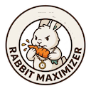

# Rabbit Maximizer

<div style="text-align: center">
  
</div>

**"Review limit. Wait 47 minutes. Request again. Repeat."**
**Rabbit Maximizer automates it.** Your CodeRabbit free tier, fully squeezed.

[](./LICENSE)

## How It Works

CodeRabbit's free tier limits how often it reviews PRs. When the limit is hit, CodeRabbit posts a review-limit comment with a wait time ("Please wait X minutes before requesting another review"). Rabbit Maximizer finds these comments, waits out the cooldown, and automatically re-requests the review.


The poll detector and scheduler run on independent intervals. The detector finds review-limit comments and enqueues PRs with their cooldown time. The scheduler picks due items and posts retrigger comments. If a retrigger hits another review limit, CodeRabbit posts a new comment — the detector finds it and the cycle continues. If the PR is closed or merged, the item is marked failed and stops retrying.

Detailed state diagrams: [Event lifecycle](docs/event-lifecycle.md) · [Queue statuses](docs/queue-status.md)

## Stack

TypeScript, Node, pnpm, Prisma (SQLite), Octokit. Runs locally as a long-lived process.

## Development

**Prerequisites:** Node >= 24, pnpm.

```bash
# Clone and install
git clone https://github.com/couimet/rabbit-maximizer.git
cd rabbit-maximizer
pnpm install

# Configure
cp .env.example .env
# Edit .env — fill in GITHUB_PAT (see "PAT Setup" section below)

# Set up the database
pnpm db:migrate

# Run
pnpm dev
```

### PAT Setup

Rabbit Maximizer needs a GitHub **fine-grained personal access token** (classic tokens also work but fine-grained is recommended). The token must be issued by a **user account** (not a GitHub App) — CodeRabbit ignores `[bot]` identities. A user PAT works for both user-owned and organization-owned repos, as long as your account has access to them.

1. Go to https://github.com/settings/personal-access-tokens/new
2. Under **Resource owner**, select your user account
3. Under **Repository access**, choose "Selected repositories" and pick the repos you want Rabbit Optimizer to watch. If you plan to filter repos via `REPO_FILTER` in `.env`, "All repositories" also works — "Public repositories" is sufficient when all your repos are public. Selecting specific repos limits exposure if the token leaks.
4. Under **Permissions**, ensure the token can read and write Issues. If you chose "Selected repositories" or "All repositories", look for **Repository permissions** and set **Issues** to "Read and write". If you chose "Public repositories", GitHub pre-configures this — you may not see the section at all.
5. Generate the token and copy it — you won't see it again
6. Paste it into `.env` as `GITHUB_PAT=<your-token>`
