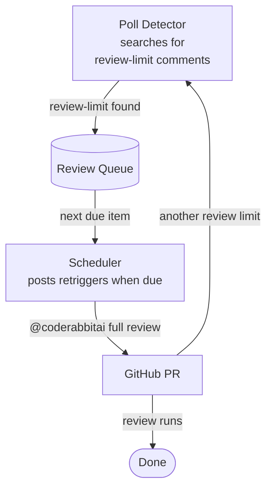

# Rabbit Maximizer

<div style="text-align: center">
  
</div>

**"Review limit. Wait 47 minutes. Request again. Repeat."**
**Rabbit Maximizer automates it.** Your CodeRabbit free tier, fully squeezed.

[](./LICENSE)

## How It Works

CodeRabbit's free tier limits how often it reviews PRs. When the limit is hit, CodeRabbit posts a review-limit comment with a wait time ("Please wait X minutes before requesting another review"). Rabbit Maximizer finds these comments, waits out the cooldown, and automatically re-requests the review.



The poll detector and scheduler run on independent intervals. The detector finds review-limit comments and enqueues PRs with their cooldown time. The scheduler picks due items and posts retrigger comments. If a retrigger hits another review limit, CodeRabbit posts a new comment — the detector finds it and the cycle continues. If the PR is closed or merged, the item is marked failed and stops retrying.

Detailed state diagrams: [Event lifecycle](docs/event-lifecycle.md) · [Queue statuses](docs/queue-status.md)

## Stack

TypeScript, Node, pnpm, Prisma (SQLite), Octokit. Runs locally as a long-lived process.

## Development

**Prerequisites:** Node >= 24, pnpm.

```bash
# Clone and install
git clone https://github.com/couimet/rabbit-maximizer.git
cd rabbit-maximizer
pnpm install

# Configure
cp .env.example .env
# Edit .env — fill in GITHUB_PAT (see "PAT Setup" section below)

# Set up the database
pnpm db:migrate

# Run
pnpm dev
```

`pnpm dev` starts the poll detector, scheduler, and a local web server on port 3000. Open `http://localhost:3000` for the dashboard — Vite provides hot reload in development, so changes to `dashboard/` appear immediately.

### Dashboard

The dashboard shows current system status across three tabs:

- **Summary** — queue counts by status, event counts from the last 24 hours, and the oldest pending PR
- **Queue** — paginated table of all queue items with status, repo, PR number, scheduled time, and attempt count
- **Events** — paginated event history grouped by PR, showing each PR's detect → enqueue → post lifecycle

### PAT Setup

Rabbit Maximizer needs a GitHub **fine-grained personal access token** (classic tokens also work but fine-grained is recommended). The token must be issued by a **user account** (not a GitHub App) — CodeRabbit ignores `[bot]` identities. A user PAT works for both user-owned and organization-owned repos, as long as your account has access to them.

1. Go to https://github.com/settings/personal-access-tokens/new
2. Under **Resource owner**, select your user account
3. Under **Repository access**, choose "All repositories" or "Selected repositories". Do **not** choose "Public repositories" — that option hides the Issues permission from the dropdown below, which means you cannot grant write access. If you pick "Selected repositories", add the repos you want Rabbit Maximizer to watch. Selecting specific repos limits exposure if the token leaks.
4. Under **Permissions** → **Repository permissions**, set both **Issues** and **Pull requests** to "Read and write". Both default to "No access", so you must change them explicitly. Issues write is required to post retrigger comments; Pull requests read/write is required to check PR state.
5. Generate the token and copy it — you won't see it again
6. Paste it into `.env` as `GITHUB_PAT=<your-token>`
