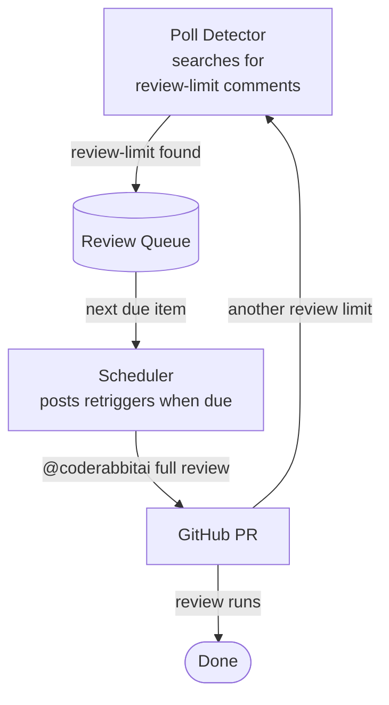

# Rabbit Maximizer

<div align="center">
  
</div>

**"Review limit. Wait 47 minutes. Request again. Repeat."**
**Rabbit Maximizer automates it.** Your CodeRabbit free tier, fully squeezed.

[](./LICENSE)

## How It Works

CodeRabbit's free tier limits how often it reviews PRs. When the limit is hit, CodeRabbit posts a review-limit comment with a wait time ("Please wait X minutes before requesting another review"). Rabbit Maximizer finds these comments, waits out the cooldown, and automatically re-requests the review.


```mermaid
flowchart TD
    detect["Poll Detector<br>searches for<br>review-limit comments"]
    queue[(Review Queue)]
    sched[Scheduler<br>posts retriggers when due]
    gh[GitHub PR]

    detect -->|review-limit found| queue
    queue -->|next due item| sched
    sched -->|"@coderabbitai full review"| gh
    gh -->|review runs| done([Done])
    gh -->|another review limit| detect
```

The poll detector and scheduler run on independent intervals. The detector finds review-limit comments and enqueues PRs with their cooldown time. The scheduler picks due items and posts retrigger comments. If a retrigger hits another review limit, CodeRabbit posts a new comment — the detector finds it and the cycle continues. If the PR is closed or merged, the item is marked failed and stops retrying.

Repos with fewer than 10 stars get no automatic reviews: CodeRabbit posts a "Review available on request" comment instead. The detector recognizes these skip comments too, enqueues a full-review trigger through the same queue, and posts `@coderabbitai full review` on the comment.

Queue statuses: [state diagram](docs/queue-status.md). Authoritative behavior: [`QueueStatus`](src/QueueStatus.ts), [`queueOrderRepository`](src/db/queueOrderRepository.ts), [`queueRepository`](src/db/queueRepository.ts)

## Stack

TypeScript, Node, pnpm, Prisma (SQLite), Octokit. Runs locally as a long-lived process.

## Development

**Prerequisites:** Node >= 24, pnpm.

```bash
# Clone and install
git clone https://github.com/couimet/rabbit-maximizer.git
cd rabbit-maximizer
pnpm install

# Configure
cp .env.example .env
# Edit .env — fill in GITHUB_PAT (see "PAT Setup" section below)

# Set up the database
pnpm db:migrate

# Run
pnpm dev
```

`pnpm dev` starts the poll detector, scheduler, and a local web server on port 3000. Open `http://localhost:3000` for the dashboard — Vite provides hot reload in development, so changes to `dashboard/` appear immediately.

### Production run

```bash
# Build the server and the dashboard
pnpm build

# Serve the built dashboard
pnpm start
```

`pnpm build` compiles the server with `tsc` and bundles the dashboard into `dist/dashboard/dist`. `pnpm start` runs the compiled server with `NODE_ENV=production`, which mounts that directory at `/`. Run `pnpm build` first: the server logs an error and exits when the build output is absent. `pnpm build:dashboard` rebuilds only the dashboard, which is useful after a change under `dashboard/`.

To check a container image before you publish it, build it and run the smoke test. The script starts the container against a throwaway volume, confirms the entrypoint refuses a missing data mount, waits for the dashboard, and stops the container:

```bash
docker build -t rabbit-maximizer:local .
IMAGE_REF=rabbit-maximizer:local ENV_FILE=.env.ci bash scripts/docker/smoke-test.sh
```

### Run with Docker

The published image holds the server and the dashboard. The repository ships `compose.yml`, and the same container starts with one `docker run` command when you prefer no Compose. Both forms publish port 3000, where the dashboard answers. Open `http://<host>:3000`, with the machine name or its IP address in place of `<host>`.

#### With Docker Compose

Copy `compose.yml` from a clone of the repository to a directory on the host, create the configuration file beside it, and start the container:

```bash
mkdir -p /opt/rabbit-maximizer/config
cp compose.yml /opt/rabbit-maximizer/
cp .env.example /opt/rabbit-maximizer/config/.env
chmod 600 /opt/rabbit-maximizer/config/.env
# Set GITHUB_PAT and REPO_FILTER in /opt/rabbit-maximizer/config/.env
cd /opt/rabbit-maximizer
docker compose up -d
```

Create `config/.env` before the first start. Docker creates a **directory** at a bind-mount source that does not exist on the host, so the container then stops with `GITHUB_PAT is required` and no configuration.

`compose.yml` mounts the configuration file read-only at `/app/.env`, pins both volume names, turns on the file log sink, and runs the container with a read-only root filesystem.

Some hosts read this file only under the name `docker-compose.yml`. Rename the copy on those hosts. Container Manager on a Synology NAS is one of them.

#### Without Compose

```bash
docker run -d --name rabbit-maximizer \
  --restart unless-stopped \
  -p 3000:3000 \
  -e LOG_TO_FILE=true \
  -v "$PWD/config/.env:/app/.env:ro" \
  -v rabbit-maximizer-data:/data \
  -v rabbit-maximizer-logs:/logs \
  --read-only --tmpfs /tmp \
  ghcr.io/couimet/rabbit-maximizer:latest

docker logs -f rabbit-maximizer
```

Remove the container with `docker rm -f rabbit-maximizer`.

Image tags: `latest` is the newest stable release, `beta` is the newest prerelease (a beta or a release candidate), and `edge` is the newest manual-dispatch build, which can break at any time.

The container runs as the non-root user `rabbit`. A named volume takes its ownership from the image, so both volumes above need no setup. A bind mount starts owned by your host user: run `chown -R 1001:1001 <host-dir>` before the first start.

`--read-only` fails every write outside the mounted volumes, so the container holds no state that a replacement would lose. The entrypoint also refuses to start when `/data` is not a mount, which catches a missing `-v rabbit-maximizer-data:/data`.

Logs go to stdout, so `docker logs` works without a volume. `LOG_TO_FILE=true` adds the rolling file sink at `/logs`, and the command above mounts that volume so the files survive a restart.

#### Upgrading

The entrypoint applies every pending migration on start. Three consequences matter before you pull a new tag.

- A migration that fails stops the container. The failed record also blocks the later starts.
- Set `SKIP_MIGRATIONS=true` to start the container against the schema the volume already holds. The app then runs on the old schema instead of refusing to start.
- Migrations run forward only. `prisma migrate deploy` warns when the volume holds migrations the image does not know, and then continues. An older image against a newer database fails at query time when a migration dropped a column that image still reads. Treat a rollback as a database restore, not a tag change.

Back up the data volume before a tag change. The image carries no `sqlite3` client and no `gzip`, so `scripts/db/backup.sh` cannot run inside it. Stop the container first, because a copy of a running SQLite file can tear while the journal changes. The helper command acts on the volume, so both deployment forms use the same one, and only the stop and the start differ. Run the Compose form from the directory that holds `compose.yml`. The steps are chained with `&&`, so a failed stop aborts the sequence before the helper runs:

```bash
# With Docker Compose
docker compose stop rabbit-maximizer \
  && docker run --rm -v rabbit-maximizer-data:/data -v "$PWD:/backup" alpine:3.24 \
       tar czf "/backup/rabbit-maximizer-data-$(date -u +%Y%m%dT%H%M%SZ).tar.gz" -C /data . \
  && docker compose start rabbit-maximizer

# Without Compose
docker stop rabbit-maximizer \
  && docker run --rm -v rabbit-maximizer-data:/data -v "$PWD:/backup" alpine:3.24 \
       tar czf "/backup/rabbit-maximizer-data-$(date -u +%Y%m%dT%H%M%SZ).tar.gz" -C /data . \
  && docker start rabbit-maximizer
```

Restore the volume with the reverse command. Replace `<file>` with the backup name. The helper extracts the archive into a staging directory on the data volume. It checks the payload for `rabbit-maximizer.db`, then swaps the payload into place with renames. The volume keeps the current database until the replacement is complete. A wrong name, an unreadable archive, a payload with no database, or a full volume therefore leaves that database in place. The staging directory holds a second copy of the payload while the command runs, so the volume needs that much free space. A failed run leaves the staging directories behind for the next run to remove. A failed step stops the sequence, so the container stays stopped until you start it again:

```bash
# With Docker Compose
docker compose stop rabbit-maximizer \
  && docker run --rm -v rabbit-maximizer-data:/data -v "$PWD:/backup" alpine:3.24 \
       sh -c 'rm -rf /data/.restore /data/.previous && mkdir -p /data/.restore && tar xzf "/backup/<file>.tar.gz" -C /data/.restore && test -f /data/.restore/rabbit-maximizer.db && mkdir -p /data/.previous && find /data -mindepth 1 -maxdepth 1 ! -name .restore ! -name .previous -exec mv {} /data/.previous/ \; && find /data/.restore -mindepth 1 -maxdepth 1 -exec mv {} /data/ \; && rm -rf /data/.previous /data/.restore' \
  && docker compose start rabbit-maximizer

# Without Compose
docker stop rabbit-maximizer \
  && docker run --rm -v rabbit-maximizer-data:/data -v "$PWD:/backup" alpine:3.24 \
       sh -c 'rm -rf /data/.restore /data/.previous && mkdir -p /data/.restore && tar xzf "/backup/<file>.tar.gz" -C /data/.restore && test -f /data/.restore/rabbit-maximizer.db && mkdir -p /data/.previous && find /data -mindepth 1 -maxdepth 1 ! -name .restore ! -name .previous -exec mv {} /data/.previous/ \; && find /data/.restore -mindepth 1 -maxdepth 1 -exec mv {} /data/ \; && rm -rf /data/.previous /data/.restore' \
  && docker start rabbit-maximizer
```

### Dashboard

The dashboard shows current system status across three tabs:

- **Summary** — queue counts by status, event counts from the last 24 hours, and the oldest pending PR
- **Queue** — paginated table of all queue items with status, repo, PR number, scheduled time, and attempt count
- **Events** — newest-first timeline of every event, one entry each, color-coded by event family with a plain-language reading of each event's payload; client-side repo and PR filters narrow the events loaded so far, and pasting a `run=<uuid>` token copied from a posted retrigger comment into the **Run** box refetches the timeline filtered to that run

### PAT Setup

Rabbit Maximizer needs a GitHub **fine-grained personal access token** (classic tokens also work but fine-grained is recommended). The token must be issued by a **user account** (not a GitHub App) — CodeRabbit ignores `[bot]` identities. A user PAT works for both user-owned and organization-owned repos, as long as your account has access to them.

1. Go to <https://github.com/settings/personal-access-tokens/new>
2. Under **Resource owner**, select your user account
3. Under **Repository access**, choose "All repositories" or "Selected repositories". Do **not** choose "Public repositories" — that option hides the Issues permission from the dropdown below, which means you cannot grant write access. If you pick "Selected repositories", add the repos you want Rabbit Maximizer to watch. Selecting specific repos limits exposure if the token leaks.
4. Under **Permissions** → **Repository permissions**, set **Issues** and **Pull requests** to "Read and write", and **Contents** to "Read". All default to "No access", so you must change them explicitly. Issues write is required to post retrigger comments; Pull requests read/write is required to check PR state; Contents read is required to fetch the head commit timestamp when the scanner records each push.
5. Generate the token and copy it — you won't see it again
6. Paste it into `.env` as `GITHUB_PAT=<your-token>`
