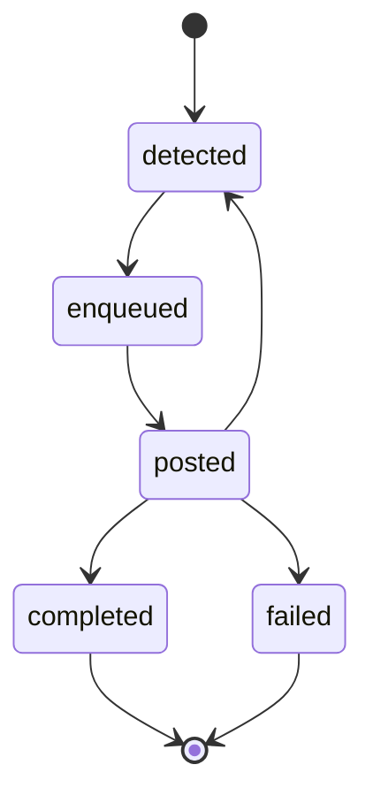

# Event Lifecycle

State diagram of the `EventType` values from `src/types/EventType.ts`. Each event is recorded as a row in the `events` table.

## Status details

| EventType   | Recorded by             | Meaning                                                                                                     |
| ----------- | ----------------------- | ----------------------------------------------------------------------------------------------------------- |
| `detected`  | Poll detector           | A CodeRabbit review-limit comment was found on a PR                                                         |
| `enqueued`  | Poll detector           | The PR was added to `review_queue` with a scheduled retrigger time                                          |
| `posted`    | Scheduler               | A `@coderabbitai full review` retrigger comment was posted on the PR                                        |
| `completed` | — (not yet implemented) | CodeRabbit review ran successfully. Tracked by [#27](https://github.com/couimet/rabbit-maximizer/issues/27) |
| `failed`    | Scheduler               | Terminal. PR was closed or merged before the retrigger could be posted                                      |

## Transition details

| From        | To          | Trigger / explanation                                                                                                             |
| ----------- | ----------- | --------------------------------------------------------------------------------------------------------------------------------- |
| `[*]`       | `detected`  | Poll detector finds a CodeRabbit review-limit comment                                                                             |
| `detected`  | `enqueued`  | PR added to `review_queue` in the same DB transaction                                                                             |
| `enqueued`  | `posted`    | Scheduler posts `@coderabbitai full review` on the PR                                                                             |
| `posted`    | `detected`  | New review-limit comment appears (poll detector picks it up, fresh item)                                                          |
| `posted`    | `completed` | CodeRabbit review completed successfully (not yet implemented — see [#27](https://github.com/couimet/rabbit-maximizer/issues/27)) |
| `posted`    | `failed`    | PR closed or merged (scheduler hits HTTP 404/410)                                                                                 |
| `completed` | `[*]`       | Terminal success                                                                                                                  |
| `failed`    | `[*]`       | Terminal failure                                                                                                                  |
