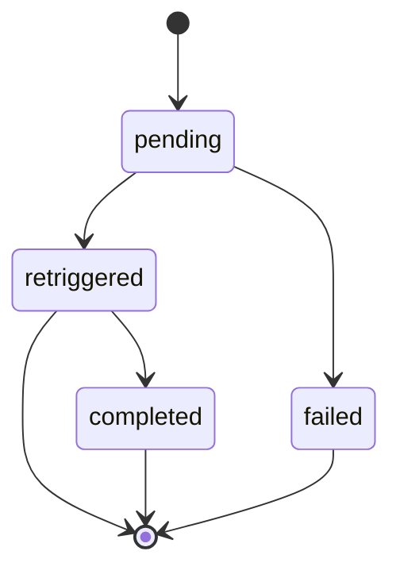

# Queue Status

State diagram of the `QueueStatus` values from `src/types/QueueStatus.ts`. Each queue item moves through these statuses as the scheduler processes it.

## Status details

| Status        | Set by                              | Meaning                                                                                                                                                                             |
| ------------- | ----------------------------------- | ----------------------------------------------------------------------------------------------------------------------------------------------------------------------------------- |
| `pending`     | `QueueRepository.enqueue()`         | Awaiting scheduler pick-up. Only `pending` items are returned by `getNextDue()`.                                                                                                    |
| `retriggered` | `QueueRepository.markRetriggered()` | Retrigger comment was posted on the PR. The scheduler does not re-pick this up. If CodeRabbit responds with another review limit, the poll detector creates a fresh `pending` item. |
| `completed`   | `CompletionDetector`                | CodeRabbit review ran successfully after retrigger. Detected by finding a non-rate-limit bot comment on the PR.                                                                     |
| `failed`      | `QueueRepository.markFailed()`      | Terminal. PR was closed or merged before the retrigger could be posted.                                                                                                             |

## Transition details

| From          | To            | Trigger / explanation                                                                          |
| ------------- | ------------- | ---------------------------------------------------------------------------------------------- |
| `[*]`         | `pending`     | Poll detector enqueues PR after detecting a review-limit comment                               |
| `pending`     | `retriggered` | Scheduler posts retrigger successfully                                                         |
| `pending`     | `failed`      | Scheduler hits HTTP 404/410 (PR closed or merged)                                              |
| `retriggered` | `completed`   | `CompletionDetector` finds a non-rate-limit `coderabbitai[bot]` comment after `retriggered_at` |
| `retriggered` | `[*]`         | Retrigger sent, awaiting outcome (cycle may restart via poll detector)                         |
| `completed`   | `[*]`         | Terminal success                                                                               |
| `failed`      | `[*]`         | Terminal failure                                                                               |
