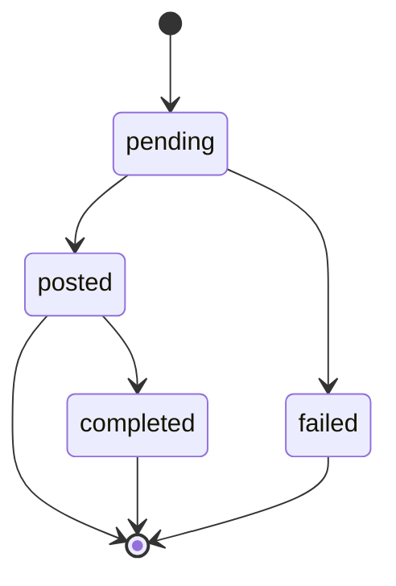

# Queue Status

State diagram of the `QueueStatus` values from `src/types/QueueStatus.ts`. Each queue item moves through these statuses as the scheduler processes it.

## Status details

| Status      | Set by                         | Meaning                                                                                                                                                                             |
| ----------- | ------------------------------ | ----------------------------------------------------------------------------------------------------------------------------------------------------------------------------------- |
| `pending`   | `QueueRepository.enqueue()`    | Awaiting scheduler pick-up. Only `pending` items are returned by `getNextDue()`.                                                                                                    |
| `posted`    | `QueueRepository.markPosted()` | Retrigger comment was posted on the PR. The scheduler does not re-pick this up. If CodeRabbit responds with another review limit, the poll detector creates a fresh `pending` item. |
| `completed` | — (not yet implemented)        | CodeRabbit review ran successfully. Tracked by [#27](https://github.com/couimet/rabbit-maximizer/issues/27).                                                                        |
| `failed`    | `QueueRepository.markFailed()` | Terminal. PR was closed or merged before the retrigger could be posted.                                                                                                             |

## Transition details

| From        | To          | Trigger / explanation                                                                                                |
| ----------- | ----------- | -------------------------------------------------------------------------------------------------------------------- |
| `[*]`       | `pending`   | Poll detector enqueues PR after detecting a review-limit comment                                                     |
| `pending`   | `posted`    | Scheduler posts retrigger successfully                                                                               |
| `pending`   | `failed`    | Scheduler hits HTTP 404/410 (PR closed or merged)                                                                    |
| `posted`    | `completed` | CodeRabbit review completed (not yet implemented — see [#27](https://github.com/couimet/rabbit-maximizer/issues/27)) |
| `posted`    | `[*]`       | Retrigger sent, awaiting outcome (cycle may restart via poll detector)                                               |
| `completed` | `[*]`       | Terminal success                                                                                                     |
| `failed`    | `[*]`       | Terminal failure                                                                                                     |
