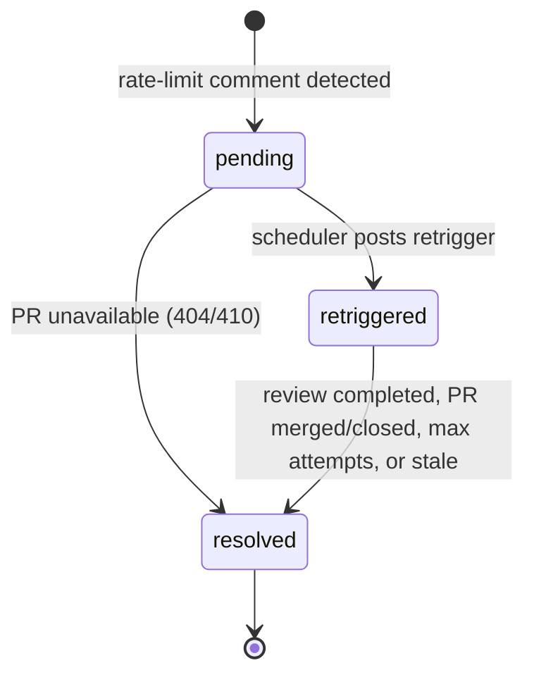

# Queue Status

State diagram of the `QueueStatus` values. For authoritative behavior, read the source: [`QueueStatus`](../src/QueueStatus.ts), [`queueRepository.enqueue()`](../src/db/queueRepository.ts), [`queueOrderRepository`](../src/db/queueOrderRepository.ts).

```mermaid
stateDiagram-v2
    [*] --> pending: rate-limit comment detected
    pending --> retriggered: scheduler posts retrigger
    pending --> resolved: PR unavailable (404/410)
    retriggered --> resolved: review completed, PR merged/closed, max attempts, or stale
    resolved --> [*]
```

`EFFECTIVE_ORDER_STATUSES` includes both `pending` and `retriggered` — both appear in Queue Order. When a new rate-limit comment arrives on a `retriggered` item, the source comment is updated in place; no new item is created.
