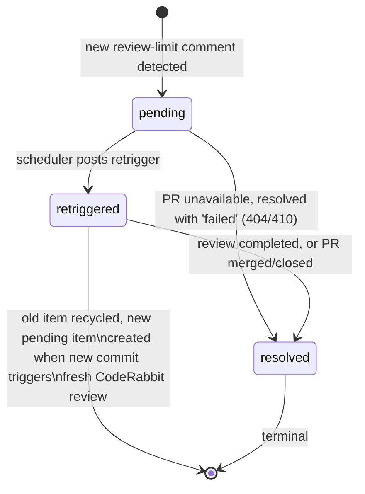

# Queue Status

State diagram of the `QueueStatus` values from `src/QueueStatus.ts`. Each queue item moves through these statuses as the scheduler processes it.

```mermaid
stateDiagram-v2
    [*] --> pending: new review-limit comment detected
    pending --> retriggered: scheduler posts retrigger
    pending --> resolved: PR unavailable, resolved with 'failed' (404/410)
    retriggered --> resolved: review completed, or PR merged/closed
    retriggered --> [*]: old item recycled, new pending item\ncreated when new commit triggers\nfresh CodeRabbit review
    resolved --> [*]: terminal
```

## Status details

| Status        | Set by                              | Meaning                                                                                                                                                                             |
| ------------- | ----------------------------------- | ----------------------------------------------------------------------------------------------------------------------------------------------------------------------------------- |
| `pending`     | `QueueRepository.enqueue()`         | Awaiting scheduler pick-up. Only `pending` items are returned by `getEffectiveOrder()`.                                                                                             |
| `retriggered` | `QueueRepository.markRetriggered()` | Retrigger comment was posted on the PR. The scheduler does not re-pick this up. If CodeRabbit responds with another review limit, the poll detector creates a fresh `pending` item. |
| `resolved`    | `QueueRepository.markResolved()`    | Terminal. The `resolution` column records why: `review_completed`, `pr_merged`, `pr_closed_without_merge`, `failed`, or `skipped`.                                                  |

## Resolution values

When `status` is `resolved`, the `resolution` column provides the reason:

| Resolution                | Set by                          | Meaning                                              |
| ------------------------- | ------------------------------- | ---------------------------------------------------- |
| `review_completed`        | `ReviewDetector`, manual action | CodeRabbit review ran successfully after retrigger   |
| `pr_merged`               | `ReviewDetector`, `Pruner`      | PR was merged before or after retrigger              |
| `pr_closed_without_merge` | `ReviewDetector`, `Pruner`      | PR was closed without merging                        |
| `failed`                  | `Scheduler`                     | Retrigger exhausted max attempts or PR is gone (404) |
| `skipped`                 | `EnqueueService`                | CodeRabbit review was skipped (rate-limit comment)   |

## Transition details

| From          | To            | Trigger / explanation                                                             |
| ------------- | ------------- | --------------------------------------------------------------------------------- |
| `[*]`         | `pending`     | Poll detector enqueues PR after detecting a review-limit comment                  |
| `pending`     | `retriggered` | Scheduler posts retrigger successfully                                            |
| `pending`     | `resolved`    | Scheduler hits HTTP 404/410 while retriggering; resolved with resolution 'failed' |
| `retriggered` | `resolved`    | `ReviewDetector` finds a completed CodeRabbit review, or PR is merged/closed      |
| `retriggered` | `[*]`         | Retrigger sent, awaiting outcome (cycle may restart via poll detector)            |
| `resolved`    | `[*]`         | Terminal — see `resolution` column for the reason                                 |
