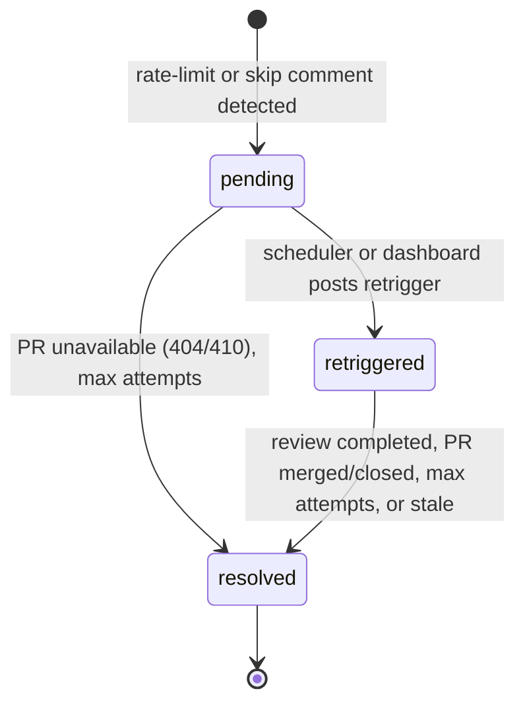

# Queue Status

State diagram and resolution reasons for the `QueueStatus` values. For authoritative behavior, read the source: [`QueueStatus`](../src/QueueStatus.ts), [`Resolution`](../src/Resolution.ts), [`queueRepository.enqueue()`](../src/db/queueRepository.ts), [`queueOrderRepository`](../src/db/queueOrderRepository.ts).

```mermaid
stateDiagram-v2
    [*] --> pending: rate-limit or skip comment detected
    pending --> retriggered: scheduler or dashboard posts retrigger
    pending --> resolved: PR unavailable (404/410), max attempts
    retriggered --> resolved: review completed, PR merged/closed, max attempts, or stale
    resolved --> [*]
```

Resolution reasons:

- `review_completed` — CodeRabbit completed a review after the request.
- `manual_review` — a human marked the item reviewed from the dashboard.
- `pr_merged` / `pr_closed_without_merge` — the PR left the open state.
- `failed` — max trigger attempts reached, terminal HTTP failure, or the retriggered item went stale.
- `skipped` — CodeRabbit re-skipped the review after the request.
- `stale_comment` — the source comment is gone and no replacement exists.

`EFFECTIVE_ORDER_STATUSES` includes both `pending` and `retriggered` — both appear in Queue Order. When a new rate-limit comment arrives on a `retriggered` item, the source comment is updated in place; no new item is created.
